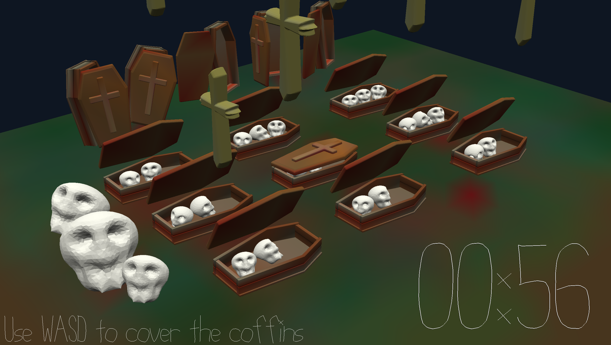

# The Resurrection Of The Vampires

Author: Wei-Che(Wizard) Hsu

Design: It's time to resurrect the vampires. Cover the coffins to protect the vampires' skull from the crosses.

Screen Shot:

How To Play:

Use WASD to cover the targeted coffin to prevent the vampires' skulls from attaked by the falling crosses. When the cross is approaching the coffin, the coffin would be trembling. As the time passing, the tempo of falling crosses would speed up, do your best to let more skulls left!
There are three vampire's skulls in each coffin. In the end, if there is at least one skull left in a coffin , that means the vampire would be resurrected. You would get bonus scores!

Sources:

This game was built with [NEST](NEST.md).
The models was built with Blender.

